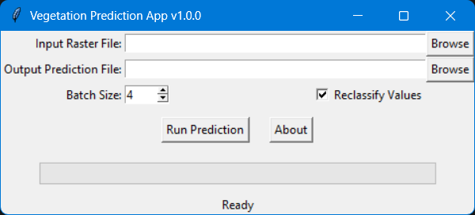

# Vegetation Prediction App

A desktop application for running vegetation classification predictions on aerial of the Santa Ana River imagery using pre-trained TensorFlow models.

🔗 **Repository:** [https://github.com/kahlilamin/sar_segmentation_2025_app](https://github.com/kahlilamin/sar_segmentation_2025_app)



---

## 🚀 Features

✅ GUI built with Tkinter  
✅ Supports batch tile-based processing  
✅ Supports GPU acceleration using DirectML  
✅ Displays progress bar and status updates  
✅ Input raster validation:
- Minimum 4 bands
- Pixel size: **0.5 ft**
- Projected CRS: **California State Plane Zone 6 (EPSG:2230 or EPSG:2875)**
- Data type: **8-bit or 16-bit integer rasters**

✅ Optional reclassification of output for use with mowing n-value app.  
✅ PyInstaller-ready for distribution

---

## 🛠 Requirements

- Python 3.10
- TensorFlow (DirectML plugin recommended on Windows devices)
- Rasterio
- Numpy
- See `requirements.txt` for full list

---

## 📂 Installation

1. Clone this repository:
   ```bash
   git clone https://github.com/kahlilamin/sar_segmentation_2025_app.git
   cd sar_segmentation_2025_app
   ```

2. Create a virtual environment:
   ```bash
   python -m venv env
   source env/bin/activate  # On Windows: env\Scripts\activate
   ```

3. Install dependencies:
   ```bash
   pip install -r requirements.txt
   ```

4. Run the app:
   ```bash
   python gui_prediction_app.py
   ```

---

## 🖥 Usage

1. Launch the app.  
2. Select your **input raster file** (must meet validation criteria).  
3. Specify your **output file path**.  
4. Adjust batch size and enable **Reclassify Values** if needed. User selects batch size based on the GPU memory available. 
5. Click **Run Prediction** to process.  
6. View progress and status updates in the GUI.

---

## 📦 Building an Executable

This app uses **PyInstaller** for packaging.

1. Build using your `.spec` file:
   ```bash
   pyinstaller veg_prediction_app.spec
   ```

2. The executable will be in the `dist/veg_prediction_app/` folder.

✔ **Note:** GDAL and PROJ data are included via `collect_data_files` in the spec. Environment variables are set at runtime for correct rasterio functionality.

---

## 🧪 Tests

- Unit tests are located in the **`tests/`** folder.
- The tests use **Python’s `unittest` framework**.
- Popups are disabled during tests using a mock for `tkinter.messagebox.showerror`.

Run all tests with:
```bash
python -m unittest discover -s tests
```

---
## 👤 Author

**Kahlil Amin**  
Senior Civil Engineer | Riverside County Flood Control and Water Conservation District  
Email: [kaamin@rivco.org](mailto:kaamin@rivco.org)

---

## 📄 License

This project is licensed under the [MIT License](LICENSE).

---